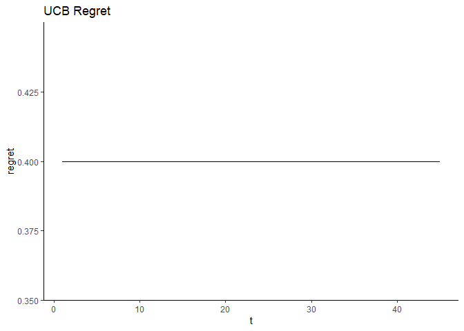

Process Qualtrics Data, Treatment Assignment Updating
================
2023-11-07

# Setup Data Using Qualtrics API

- Load data directly from Qualtrics
- Can store API Key and credentials in `.renviron`

``` r
library(tidyverse)
library(qualtRics)
library(magrittr)
library(RColorBrewer)

knitr::opts_chunk$set(cache.extra = 2023)

source("./plotting_functions.R")
```

``` r
# datacenterid <- ""
# url <- str_glue("https://{datacenterid}.qualtrics.com")
# api_key <- ""
#
# qualtrics_api_credentials(api_key = api_key,
#                           base_url = url,
#                           install = TRUE,
#                           overwrite=T)

readRenviron("~/.Renviron")
# load survey data
surveys <- all_surveys()
# select political candidates survey ID
pc_id <- surveys[surveys["name"] == "Political Candidates", ][["id"]]

pc_survey <- fetch_survey(
  surveyID = pc_id,
  verbose = TRUE
)
```

    ##   |                                                                              |                                                                      |   0%  |                                                                              |======================================================================| 100%

    ## 
    ## ── Column specification ────────────────────────────────────────────────────────
    ## cols(
    ##   .default = col_character(),
    ##   StartDate = col_datetime(format = ""),
    ##   EndDate = col_datetime(format = ""),
    ##   Progress = col_double(),
    ##   `Duration (in seconds)` = col_double(),
    ##   Finished = col_logical(),
    ##   RecordedDate = col_datetime(format = ""),
    ##   RecipientLastName = col_logical(),
    ##   RecipientFirstName = col_logical(),
    ##   RecipientEmail = col_logical(),
    ##   ExternalReference = col_logical(),
    ##   LocationLatitude = col_double(),
    ##   LocationLongitude = col_double(),
    ##   QD2_1_TEXT = col_double(),
    ##   rnum = col_double(),
    ##   pi1 = col_double(),
    ##   pi2 = col_double(),
    ##   pi3 = col_double(),
    ##   pi4 = col_double(),
    ##   pi5 = col_double(),
    ##   pi6 = col_double()
    ##   # ... with 16 more columns
    ## )
    ## ℹ Use `spec()` for the full column specifications.

## Survey Validation

``` r
pc_survey %>%
  distinct(Status)
```

    ## # A tibble: 3 × 1
    ##   Status        
    ##   <chr>         
    ## 1 Survey Preview
    ## 2 IP Address    
    ## 3 Survey Test

``` r
# validate survey logic on test data
pc_survey %>%
  filter(Status == "Survey Test")
```

    ## # A tibble: 105 × 71
    ##    StartDate           EndDate             Status      IPAddress Progr…¹ Durat…²
    ##    <dttm>              <dttm>              <chr>       <chr>       <dbl>   <dbl>
    ##  1 2023-11-03 11:03:07 2023-11-03 11:03:07 Survey Test <NA>          100       0
    ##  2 2023-11-03 11:03:07 2023-11-03 11:03:07 Survey Test <NA>          100       0
    ##  3 2023-11-03 11:03:07 2023-11-03 11:03:07 Survey Test <NA>          100       0
    ##  4 2023-11-03 11:03:07 2023-11-03 11:03:07 Survey Test <NA>          100       0
    ##  5 2023-11-03 11:03:07 2023-11-03 11:03:07 Survey Test <NA>          100       0
    ##  6 2023-11-03 11:03:08 2023-11-03 11:03:08 Survey Test <NA>          100       0
    ##  7 2023-11-03 11:03:08 2023-11-03 11:03:08 Survey Test <NA>          100       0
    ##  8 2023-11-03 11:03:08 2023-11-03 11:03:08 Survey Test <NA>          100       0
    ##  9 2023-11-03 11:03:08 2023-11-03 11:03:08 Survey Test <NA>          100       0
    ## 10 2023-11-03 11:03:08 2023-11-03 11:03:08 Survey Test <NA>          100       0
    ## # … with 95 more rows, 65 more variables: Finished <lgl>, RecordedDate <dttm>,
    ## #   ResponseId <chr>, RecipientLastName <lgl>, RecipientFirstName <lgl>,
    ## #   RecipientEmail <lgl>, ExternalReference <lgl>, LocationLatitude <dbl>,
    ## #   LocationLongitude <dbl>, DistributionChannel <chr>, UserLanguage <chr>,
    ## #   Consent <ord>, `Prolific ID Q` <chr>, PreScreen_Q1 <ord>,
    ## #   Commitment_Q1 <ord>, Commitment_Q2 <chr>, Q1 <ord>, Q2 <ord>, Q3 <ord>,
    ## #   Q4 <ord>, Q5 <ord>, Q6 <ord>, Q7 <ord>, Q8 <ord>, Manipulation_Q1 <ord>, …

``` r
# should be missing if do not consent
pc_survey %>%
  filter(Status == "Survey Test", Consent == "I do not consent to participate") %>%
  mutate(Q2 = as.character(Q2)) %>%
  distinct(`Q2`) %>%
  is.na() %>%
  stopifnot()

# note: question was different prior to 11/06
# check that if failing prescreen question about location in the US
# this should be missing
pc_survey %>%
  filter(
    Status == "Survey Test", PreScreen_Q1 != "Yes",
    StartDate >= lubridate::ymd("2023-11-06")
  ) %>%
  mutate(Q1 = as.character(Q1)) %>%
  distinct(Q1) %>%
  is.na() %>%
  stopifnot()
```

# Examine the test data

- Check if `rnum` and `pi_i` values are working properly

``` r
pc_survey_test <- pc_survey %>%
  filter(Status == "Survey Test") %>%
  # create 'profile' variable
  mutate(profile = case_when(
    rnum <= pi1 ~ 1,
    rnum > pi1 & rnum <= pi2 ~ 2,
    rnum > pi2 & rnum <= pi3 ~ 3,
    rnum > pi3 & rnum <= pi4 ~ 4,
    rnum > pi4 & rnum <= pi5 ~ 5,
    rnum > pi5 & rnum <= pi6 ~ 6,
    rnum > pi6 & rnum <= pi7 ~ 7,
    rnum > pi7 ~ 8
  ))


# check distributoin
# this should be evenly distributed
# each should be about 1/8 of the data
nrow(pc_survey_test) / 8
```

    ## [1] 13.125

``` r
pc_survey_test %>%
  ggplot(aes(profile)) +
  geom_histogram() +
  theme_classic()
```

    ## `stat_bin()` using `bins = 30`. Pick better value with `binwidth`.

<!-- -->

``` r
# create numeric versions of the profiles
# should be =1 if selecting the younger candidate
# this depends on whether the younger candidate
# is candidate 1 or candidate 2
pc_survey_recode <- pc_survey_test %>%
  mutate(across(str_c("Q", 1:8), ~ case_when(
    . == "Candidate 1" & rnum_age <= 0.5 ~ 1,
    . == "Candidate 2" & rnum_age > 0.5 ~ 1,
    TRUE ~ 0
  ))) %>%
  mutate(total_Q = select(., str_c("Q", 1:8)) %>%
    rowSums())

# check row total is not more than 1
# 0 if selected the older candidate
pc_survey_recode %>%
  select(str_c("Q", 1:8)) %>%
  rowSums() %>%
  is_weakly_less_than(1) %>%
  all() %>%
  stopifnot()
```

## Create fake data

``` r
# create fake data
# batch size is the size of the batches (here = 100)
batch_size <- 100
```

``` r
# pi is a vector of probabilities
# size is the number of observations
# C is number of arms
assign_treatment <- function(pi, profile_prob, size, C = 8) {
  df_fake <- data.frame(matrix(0, ncol = C, nrow = (size)))
  names(df_fake) <- str_c("Q", 1:C)
  df_fake["profile"] <- 0

  # want to get even distribution within each batch
  for (i in 1:batch_size) {
    rnum <- runif(1)
    profile <- case_when(
      rnum < pi[1] ~ 1,
      rnum >= pi[1] & rnum < sum(pi[1:2]) ~ 2,
      rnum >= sum(pi[1:2]) & rnum < sum(pi[1:3]) ~ 3,
      rnum >= sum(pi[1:3]) & rnum < sum(pi[1:4]) ~ 4,
      rnum >= sum(pi[1:4]) & rnum < sum(pi[1:5]) ~ 5,
      rnum >= sum(pi[1:5]) & rnum < sum(pi[1:6]) ~ 6,
      rnum >= sum(pi[1:6]) & rnum < sum(pi[1:7]) ~ 7,
      rnum >= sum(pi[1:7]) ~ 8
    )
    # alternative method
    # profile <- match(1, rmultinom(1, size = 1, prob = pi))

    # this is to simulate fake data
    df_fake[i, str_c("Q", profile)] <- rbinom(1, 1, profile_prob[profile])
    df_fake[i, "profile"] <- profile
  }
  return(df_fake)
}
```

``` r
profile_prob <- c(0.9, 0.5, 0.3, 0.5, 0.4, 0.7, 0.5, 0.44)
pi <- rep(0.125, 8)

pc_survey_fake <- assign_treatment(pi, profile_prob, batch_size)
pc_survey_fake %>%
  head()
```

    ##   Q1 Q2 Q3 Q4 Q5 Q6 Q7 Q8 profile
    ## 1  0  0  0  0  0  0  0  0       2
    ## 2  0  0  0  0  0  0  0  0       5
    ## 3  0  0  0  0  0  0  0  0       4
    ## 4  0  0  0  0  0  0  1  0       7
    ## 5  0  0  0  0  0  1  0  0       6
    ## 6  0  0  0  1  0  0  0  0       4

### Examine fake data

- Check distribution of profiles overll and by batch

``` r
pc_survey_fake %>%
  ggplot(aes(profile)) +
  geom_histogram() +
  theme_classic()
```

    ## `stat_bin()` using `bins = 30`. Pick better value with `binwidth`.

<!-- -->

``` r
pc_survey_fake %>%
  pivot_longer(-c(profile)) %>%
  group_by(profile) %>%
  summarize(mean = mean(value)) %>%
  ggplot(aes(profile, mean)) +
  geom_col() +
  theme_classic()
```

<!-- -->

``` r
pc_survey_fake %>%
  # share of respondents who select
  # the younger candidate
  pivot_longer(-c(profile)) %>%
  group_by(profile) %>%
  summarize(
    mean = mean(value),
    total = sum(value)
  )
```

    ## # A tibble: 8 × 3
    ##   profile   mean total
    ##     <dbl>  <dbl> <dbl>
    ## 1       1 0.0833     4
    ## 2       2 0.0625     5
    ## 3       3 0.0694     5
    ## 4       4 0.0536     6
    ## 5       5 0.0556     8
    ## 6       6 0.0962    10
    ## 7       7 0.0556     4
    ## 8       8 0.0476     8

# Algorithms

Much of the following code comes from this
[tutorial](https://mollyow.shinyapps.io/adaptive)

## Normal Experiment

- The treatment assignment probabilities do not change

``` r
c <- 8
R <- 1000
eps <- 0.1 # for epsilon greedy alg

# if our full sample is 4500
# then our no. of time steps is 45
N <- 4500
T <- N / batch_size
pi_init <- rep(0.125, 8)
```

``` r
# init parameters
profiles_selected <- integer(0)
numbers_of_rewards_1 <- integer(c) # vector for each arm
numbers_of_rewards_0 <- integer(c)
total_reward <- 0
pi <- lst(pi_init) # init uniform treatment assignment
regret <- lst()

df_list <- tibble()
for (n in 1:T) { # for T runs (in our case 45)
  # subset data into 100 obs and assign treatment randomly
  df_subset <- assign_treatment(pi[[n]], profile_prob, batch_size, C = c)
  df_list <- bind_rows(df_list, df_subset)
  stopifnot(nrow(df_subset) == batch_size)
  max_random <- 0
  profile_val <- 1

  # iterate through all context arms
  for (i in 1:c) {
    # draw from prior distribution for theta
    # for each arm
    # alpha, beta parameters depend
    # on the number of prior rewards
    random_theta <- rbeta(
      n = 1,
      shape1 = numbers_of_rewards_1[i] + 1,
      shape2 = numbers_of_rewards_0[i] + 1
    )

    if (random_theta > max_random) {
      # if arm is better than all the previous ones
      # this arm is selected, choose theta
      max_random <- random_theta
      profile_val <- i
    }
  }

  # after selecting the argmax, add to selected profile
  profiles_selected <- append(profiles_selected, profile_val)

  # checking with data (what is *observed*)
  # update based on reward
  obs_outcome <- df_subset %>%
    filter(profile == profile_val) %>%
    magrittr::extract2(str_c("Q", profile_val))

  reward0 <- sum(obs_outcome == 0)
  reward1 <- sum(obs_outcome == 1)
  numbers_of_rewards_0[profile_val] <- numbers_of_rewards_0[profile_val] + reward0
  numbers_of_rewards_1[profile_val] <- numbers_of_rewards_1[profile_val] + reward1

  total_reward <- total_reward + reward1

  # need to generate new pi
  # will preserve as unfirom
  pi[n + 1] <- lst(c(0.125, c))

  # calculate per-period regret
  # expectation of best arm vs. expectation of chosen arm
  regret[n] <- max(profile_prob) - mean(profile_prob[profiles_selected])
}
```

``` r
# store impt values for comparison
pi_exp <- pi
profiles_selected_exp <- profiles_selected
regret_exp <- regret
```

### Normal experiment: plotting results

``` r
plot_selected_profiles(profiles_selected_exp)
```

<!-- -->

``` r
plot_observed_profiles(df_list)
```

<!-- -->

``` r
plot_dist(numbers_of_rewards_1, numbers_of_rewards_0, c)
```

<!-- -->

``` r
plot_regret(regret_exp, name = "Experiment (no probability assignment updating)")
```

<!-- -->

## Greedy Algorithm

- use the expected values of the Beta distribution

``` r
# init parameters
profiles_selected <- integer(0)
numbers_of_rewards_1 <- integer(c) # vector for each arm
numbers_of_rewards_0 <- integer(c)
total_reward <- 0
pi <- lst(pi_init) # init uniform treatment assignment
regret <- lst()

for (n in 1:T) { # for T runs (in our case 45)
  # subset data into 100 obs and assign treatment randomly
  df_subset <- assign_treatment(pi[[n]], profile_prob, batch_size, C = c)
  stopifnot(nrow(df_subset) == batch_size)
  max_random <- 0
  profile_val <- 1

  # iterate through all context arms
  for (i in 1:c) {
    # draw from prior distribution for theta
    # for each arm
    # alpha, beta parameters depend
    # on the number of prior rewards
    alpha <- numbers_of_rewards_1[i] + 1
    beta <- numbers_of_rewards_0[i] + 1
    exp_theta <- alpha / (alpha + beta)

    if (exp_theta > max_random) {
      # if arm is better than all the previous ones
      # this arm is selected, choose theta
      max_random <- random_theta
      profile_val <- i
    }
  }

  # after selecting the argmax, add to selected profile
  profiles_selected <- append(profiles_selected, profile_val)

  # checking with data (what is *observed*)
  # update based on reward
  obs_outcome <- df_subset %>%
    filter(profile == profile_val) %>%
    magrittr::extract2(str_c("Q", profile_val))

  reward0 <- sum(obs_outcome == 0)
  reward1 <- sum(obs_outcome == 1)
  numbers_of_rewards_0[profile_val] <- numbers_of_rewards_0[profile_val] + reward0
  numbers_of_rewards_1[profile_val] <- numbers_of_rewards_1[profile_val] + reward1

  total_reward <- total_reward + reward1

  # need to generate new pi
  # this is the probability each arm is the best
  # we can do this by simulating R random samples and calculating the probability
  # that each arm is optimal

  # Approximate Thompson Sampling probabilities (i.e. prob. that each arm is maximal)
  # (this is from Offer-Westort et al.)
  # 1) Sample from each of the posteriors R times
  draws <- replicate(R, rbeta(c, numbers_of_rewards_1, numbers_of_rewards_0))
  # 2) Check how many times each arm was maximal
  argmax <- apply(draws, 2, which.max)
  # 3) Tally up the probabilities
  pi[n + 1] <- lst(table(cut(argmax, 0:c)) / R)

  # calculate per-period regret
  # expectation of best arm vs. expectation of chosen arm
  regret[n] <- max(profile_prob) - mean(profile_prob[profiles_selected])
}
```

``` r
# store impt values for comparison
pi_greedy <- pi
profiles_selected_greedy <- profiles_selected
regret_greedy <- regret
```

### Greedy Bernoulli: plotting results

``` r
plot_selected_profiles(profiles_selected)
```

<!-- -->

``` r
plot_observed_profiles(df_list)
```

<!-- -->

``` r
plot_dist(numbers_of_rewards_1, numbers_of_rewards_0, c)
```

    ## New names:
    ## New names:
    ## New names:
    ## New names:
    ## New names:
    ## New names:
    ## New names:
    ## • `value` -> `value...1`
    ## • `value` -> `value...2`

<!-- -->

``` r
plot_regret(regret_greedy, name = "Greedy TS")
```

<!-- -->

## Thompson Sampling

``` r
# init parameters
profiles_selected <- integer(0)
numbers_of_rewards_1 <- integer(c) # vector for each arm
numbers_of_rewards_0 <- integer(c)
total_reward <- 0
pi <- lst(pi_init) # init uniform treatment assignment
regret <- lst()

df_list <- tibble()
for (n in 1:T) { # for T runs (in our case 45)
  # subset data into 100 obs and assign treatment randomly
  df_subset <- assign_treatment(pi[[n]], profile_prob, batch_size, C = c)
  df_list <- bind_rows(df_list, df_subset)
  stopifnot(nrow(df_subset) == batch_size)
  max_random <- 0
  profile_val <- 1

  # iterate through all context arms
  for (i in 1:c) {
    # draw from prior distribution for theta
    # for each arm
    # alpha, beta parameters depend
    # on the number of prior rewards
    random_theta <- rbeta(
      n = 1,
      shape1 = numbers_of_rewards_1[i] + 1,
      shape2 = numbers_of_rewards_0[i] + 1
    )

    if (random_theta > max_random) {
      # if arm is better than all the previous ones
      # this arm is selected, choose theta
      max_random <- random_theta
      profile_val <- i
    }
  }

  # after selecting the argmax, add to selected profile
  profiles_selected <- append(profiles_selected, profile_val)

  # checking with data (what is *observed*)
  # update based on reward
  obs_outcome <- df_subset %>%
    filter(profile == profile_val) %>%
    magrittr::extract2(str_c("Q", profile_val))

  reward0 <- sum(obs_outcome == 0)
  reward1 <- sum(obs_outcome == 1)
  numbers_of_rewards_0[profile_val] <- numbers_of_rewards_0[profile_val] + reward0
  numbers_of_rewards_1[profile_val] <- numbers_of_rewards_1[profile_val] + reward1

  total_reward <- total_reward + reward1

  # need to generate new pi
  # this is the probability each arm is the best
  # we can do this by simulating R random samples and calculating the probability
  # that each arm is optimal

  # Approximate Thompson Sampling probabilities (i.e. prob. that each arm is maximal)
  # (this is from Offer-Westort et al.)
  # 1) Sample from each of the posteriors R times
  draws <- replicate(R, rbeta(c, numbers_of_rewards_1, numbers_of_rewards_0))
  # 2) Check how many times each arm was maximal
  argmax <- apply(draws, 2, which.max)
  # 3) Tally up the probabilities
  pi[n + 1] <- lst(table(cut(argmax, 0:c)) / R)

  # calculate per-period regret
  # expectation of best arm vs. expectation of chosen arm
  regret[n] <- max(profile_prob) - mean(profile_prob[profiles_selected])
}
```

``` r
# store impt values for comparison
pi_ts <- pi
profiles_selected_ts <- profiles_selected
regret_ts <- regret
```

### TS: plotting results

``` r
plot_selected_profiles(profiles_selected_ts)
```

<!-- -->

``` r
plot_observed_profiles(df_list)
```

<!-- -->

``` r
plot_dist(numbers_of_rewards_1, numbers_of_rewards_0, c)
```

<!-- -->

``` r
plot_regret(regret_ts)
```

<!-- -->

## Epsilon Greedy

- From Offer-Westort et al. (2020): in the Epsilon Greedy algorithm, we
  identify which arm has the highest mean outcome. We assign treatment
  to that arm in (1−) portion of assignments, and assign treatment
  uniformly at random in the remaining assignments.
- Note: can also allow epsilon to decay over time

``` r
# init parameters
profiles_selected <- integer(0)
numbers_of_rewards_1 <- integer(c) # vector for each arm
numbers_of_rewards_0 <- integer(c)
total_reward <- 0
pi <- lst(pi_init) # init uniform treatment assignment
regret <- lst()

for (n in 1:T) { # for T runs (in our case 45)
  # subset data into 100 obs and assign treatment randomly
  df_subset <- assign_treatment(pi[[n]], profile_prob, batch_size, C = c)
  df_list <- bind_rows(df_list, df_subset)
  stopifnot(nrow(df_subset) == batch_size)
  max_random <- 0
  profile_val <- 1

  # identify which arm has highest mean outcome
  sorted_df <- df_subset %>%
    pivot_longer(-profile, names_to = "arm", values_to = "reward") %>%
    group_by(profile) %>%
    summarize(mean_reward = mean(reward)) %>%
    arrange(desc(mean_reward))

  # highest arm is the first one
  profile_val <- sorted_df[1, ][["profile"]]

  # after selecting the argmax, add to selected profile
  profiles_selected <- append(profiles_selected, profile_val)

  # checking with data (what is *observed*)
  # update based on reward
  obs_outcome <- df_subset %>%
    filter(profile == profile_val) %>%
    magrittr::extract2(str_c("Q", profile_val))

  reward0 <- sum(obs_outcome == 0)
  reward1 <- sum(obs_outcome == 1)
  numbers_of_rewards_0[profile_val] <- numbers_of_rewards_0[profile_val] + reward0
  numbers_of_rewards_1[profile_val] <- numbers_of_rewards_1[profile_val] + reward1

  total_reward <- total_reward + reward1

  # need to generate new pi
  pi_n <- rep(eps, c)
  pi_n[profile_val] <- 1 - eps
  pi[n + 1] <- lst(pi_n)

  # calculate per-period regret
  # expectation of best arm vs. expectation of chosen arm
  regret[n] <- max(profile_prob) - mean(profile_prob[profiles_selected])
}
```

``` r
# store impt values for comparison
pi_eg <- pi
profiles_selected_eg <- profiles_selected
regret_eg <- regret
```

### Epsilon-Greedy: plotting results

``` r
plot_selected_profiles(profiles_selected_eg, name = "Epsilon Greedy")
```

<!-- -->

``` r
plot_observed_profiles(df_list)
```

<!-- -->

``` r
plot_dist(numbers_of_rewards_1, numbers_of_rewards_0, c)
```

<!-- -->

``` r
plot_regret(regret_eg, name = "Epsilon Greedy Regret")
```

<!-- -->

## UCB (Upper Confidence Bound)

- observe sample means under each of the arms, and then we compute
  uncertainty bounds around each of those estimates (note that these are
  not the same as confidence intervals under a normal approximation)
- goal is to reduce uncertainty

``` r
# init parameters
profiles_selected <- integer(0)
numbers_of_rewards_1 <- integer(c) # vector for each arm
numbers_of_rewards_0 <- integer(c)
total_reward <- 0
pi <- lst(pi_init) # init uniform treatment assignment
regret <- lst()

for (n in 1:T) { # for T runs (in our case 45)
  # subset data into 100 obs and assign treatment randomly
  df_subset <- assign_treatment(pi[[n]], profile_prob, batch_size, C = c)
  df_list <- bind_rows(df_list, df_subset)
  stopifnot(nrow(df_subset) == batch_size)
  max_random <- 0
  profile_val <- 1

  # identify ucb arm
  sorted_df <- df_subset %>%
    pivot_longer(-profile, names_to = "arm", values_to = "success") %>%
    group_by(profile) %>%
    summarize(
      successes = sum(success),
      trials = n()
    ) %>%
    ungroup() %>%
    mutate(ucb_arm = successes / trials + sqrt(1 * log(sum(trials)) / trials)) %>%
    arrange(desc(ucb_arm))

  # update selected arm
  profile_val <- sorted_df[1, ][["profile"]]

  # after selecting the argmax, add to selected profile
  profiles_selected <- append(profiles_selected, profile_val)

  # checking with data (what is *observed*)
  # update based on reward
  obs_outcome <- df_subset %>%
    filter(profile == profile_val) %>%
    magrittr::extract2(str_c("Q", profile_val))

  reward0 <- sum(obs_outcome == 0)
  reward1 <- sum(obs_outcome == 1)
  numbers_of_rewards_0[profile_val] <- numbers_of_rewards_0[profile_val] + reward0
  numbers_of_rewards_1[profile_val] <- numbers_of_rewards_1[profile_val] + reward1

  total_reward <- total_reward + reward1

  # need to generate new pi
  pi_n <- rep(0, c)
  pi_n[profile_val] <- 1
  pi[n + 1] <- lst(pi_n)

  # calculate per-period regret
  # expectation of best arm vs. expectation of chosen arm
  regret[n] <- max(profile_prob) - mean(profile_prob[profiles_selected])
}
```

``` r
# store impt values for comparison
pi_ucb <- pi
profiles_selected_ucb <- profiles_selected
regret_ucb <- regret
```

### UCB: plotting results

``` r
plot_selected_profiles(profiles_selected_ucb, name = "UCB")
```

<!-- -->

``` r
plot_observed_profiles(df_list)
```

<!-- -->

``` r
plot_dist(numbers_of_rewards_1, numbers_of_rewards_0, c)
```

<!-- -->

``` r
plot_regret(regret_ucb, name = "UCB Regret")
```

<!-- -->

## Compare treatment assignments over time

``` r
tibble(
  "pi" = map(2:T, ~ pi_greedy[[.]]),
  "arm" = map(2:T, ~ c(1:8))
) %>%
  mutate(id = row_number()) %>%
  unnest(cols = c(pi, arm)) %>%
  ggplot(aes(id, pi)) +
  geom_line() +
  facet_wrap(~arm) +
  theme_classic() +
  labs(
    title = "Greedy Bernoulli Treatment Assignments over time",
    x = "Time",
    y = "Probability of being the best arm"
  ) +
  scale_y_continuous(limits = c(0, 1), breaks = seq(0, 1, 0.2))
```

<!-- -->

``` r
tibble(
  "pi" = map(2:T, ~ pi_ts[[.]]),
  "arm" = map(2:T, ~ c(1:8))
) %>%
  mutate(id = row_number()) %>%
  unnest(cols = c(pi, arm)) %>%
  ggplot(aes(id, pi)) +
  geom_line() +
  facet_wrap(~arm) +
  theme_classic() +
  labs(
    title = "TS Treatment Assignments over time",
    x = "Time",
    y = "Probability of being the best arm"
  ) +
  scale_y_continuous(limits = c(0, 1), breaks = seq(0, 1, 0.2))
```

<!-- -->

``` r
tibble(
  "pi" = map(2:T, ~ pi_eg[[.]]),
  "arm" = map(2:T, ~ c(1:8))
) %>%
  mutate(id = row_number()) %>%
  unnest(cols = c(pi, arm)) %>%
  ggplot(aes(id, pi)) +
  geom_line() +
  facet_wrap(~arm) +
  theme_classic() +
  labs(
    title = "Epsilon-Greedy Treatment Assignments over time",
    x = "Time",
    y = "Probability of being the best arm"
  ) +
  scale_y_continuous(limits = c(0, 1), breaks = seq(0, 1, 0.2))
```

<!-- -->

``` r
# put all types of regret onto one plot
tibble(
  "t" = c(1:length(regret_exp)),
  "Regret (no update)" = unlist(regret_exp),
  "Greedy TS" = unlist(regret_greedy),
  "Thompson Sampling Regret" = unlist(regret_ts),
  "Epsilon Greedy Regret" = unlist(regret_eg),
  "UCB Regret" = unlist(regret_ucb)
) %>%
  pivot_longer(-t, names_to = "Algorithm", values_to = "Regret") %>%
  ggplot(aes(t, Regret, color = Algorithm)) +
  geom_line() +
  theme_classic()
```

<!-- -->
